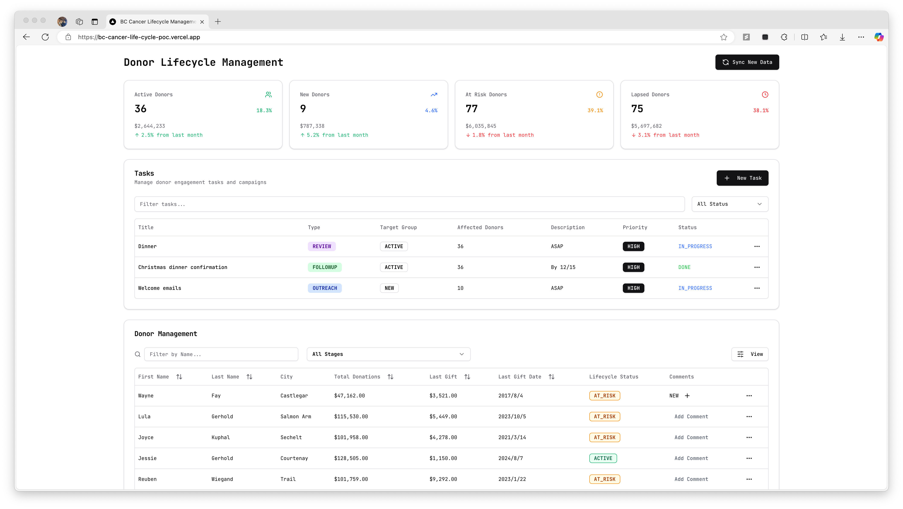

# BC Cancer Donor Lifecycle POC

> **[LIVE DEMO](https://bc-cancer-life-cycle-poc.vercel.app/)**

> 

A proof-of-concept dashboard for managing donor lifecycles, tasks, and engagement. Includes automated categorization and easy-to-use management tools.

## Features

- **`Donor Dashboard`**:
  - Key metrics for donor lifecycle stages: Active, New, At Risk, and Lapsed.
  - Trends and insights for donations.

- **`Task Management`**:
  - Create and manage tasks for donor engagement campaigns.
  - Filter tasks by status or priority.

- **`Donor Table`**:
  - Search and filter donors by name, city, or lifecycle stage.
  - Sortable, paginated table with lifecycle and donation details.
  - Add comments for individual donors.
  
- **`Automated Lifecycle Categorization`**:
  - Auto-classifies donors into stages (`NEW`, `ACTIVE`, `AT_RISK`, `LAPSED`) based on donation patterns and activity.

## Auto Categorize logic

The donor lifecycle stage is automatically determined based on the following criteria:

1. Immediate Lapsed: Donors marked as excluded or deceased are automatically categorized as LAPSED.

2. **`New`**: Donors whose first gift occurred within the last 6 months are classified as NEW.

3. **`At Risk`**: Donors flagged as AT_RISK based on:

   - No gifts for over 18 months.
   - Significant reduction in donations compared to the last fiscal year.
   - Total contributions falling below 40% of the last fiscal year's total.

4. **`Lapsed`**: No donations in the past 4 years are marked as LAPSED.

5. **`Active Donors`**: Donors who do not meet the criteria for other stages are considered ACTIVE.

## Tech Stacks

### Frontend

- `Next.js`
- `Shadcn UI`

### Backend

- `Bun` + `Hono`
- `PostgreSQL` + `Prisma`

### Deploy

- Frontend: `Vercel`
- Backend: `Render`

## LICENSE
